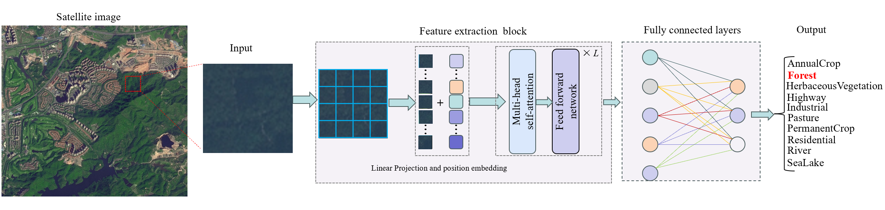

# Classification-of-Land-Cover-and-Land-Use
This repository contains a collection of Jupyter Notebooks and necessary Python scripts that demonstrate the application of a deep learning image classification algorithm named Swin Transformer for the classification of satellite imagery data.  

**For implementation:**
* Dataset can be downloaded from the link [*here*](https://github.com/phelber/eurosat?tab=readme-ov-file).
* Run the notebook to sequentially install the required packages, configure the experimental environment, and train the model.

## The problem to be tacke:
Utilizing satellite imagery for land cover and land use classification plays a crucial role and holds significant meaning in fields such as environmental management, land planning, agricultural development, and natural resource conservation. However, the spatial distribution of different land cover types is complex, making the improvement of classification accuracy a challenging task. With the continuous development of computing power and deep learning, image classification networks based on CNN (Convolutional Neural Networks) and Transformers have been extensively researched and applied. Therefore, this work aims to employ deep learning techniques, particularly by integrating the strengths of both CNNs and Transformer networks, to achieve precise classification of land cover and land use.  

## Overview:

Satellite scanning of the earth yields images that can be cropped and fed into artificial intelligence algorithms to obtain land use and land cover classification results. The dataset used in this work is the RGB version of EuroSAT, which is based on multispectral images from the Sentinel-2 satellite. The dataset contains a total of 10 categories, each containing 2000-3000 images with a resolution size of 64*64 pixels, and each pixel represents a spatial coverage of 10 meters.

The flowchart of the methodology used for land cover and land use classification adopted in this work is shown in Fig. 1. Based on the pre-trained powerful image classification algorithm Swin Transformer, the algorithm is modified and fine-tuned using the EuroSAT image dataset. The image is first partitioned into patches, then flattened and positional coding is added, and then fed into the Transformer model for multi-head self-attention learning. Finally, the land use and land cover type of the area represented by this image is output using the fully connected layers.

## Method:
.")

Swin Transformer is a deep learning model based on the self-attention mechanism, designed specifically for processing image data. Compared to traditional Convolutional Neural Networks (CNNs) and Vision Transformer (ViT), Swin Transformer introduces a novel window mechanism that divides an image into a series of overlapping image patches and uses a self-attention mechanism to capture global dependencies between image patches. This window mechanism maintains the efficiency of the model in processing large size images and also shows better performance in capturing long range dependencies.

The network structure of Swin Transformer is shown in Fig. 2. Its core structure consists of hierarchical Swin Transformer blocks, each block consists of a shifted window based multi-head self attention (MSA) module, followed by a 2-layer MLP with GELU non-linearity in between. And a LayerNorm  layer is applied before each MSA module and each MLP, and a residual connection is applied after each module.

Compared to CNNs, Swin Transformer can capture global dependencies between image patches without being limited by a fixed receptive field size, thereby possessing stronger modeling capabilities. Compared to ViT, Swin Transformer has advantages in efficiency, capturing long-range dependencies, flexible feature processing, and suitability for large-scale image data. Therefore, this work adopts pre-trained Swin Transformer for transfer learning, fine-tuning the model using remote sensing image data to accomplish automatic classification of land use and land cover.

## Results:

